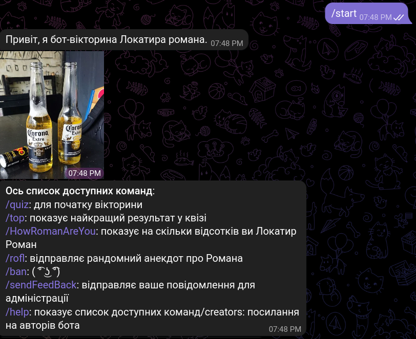

# Lokatir Telegram Bot: A Tribute to Roman Lokatir

Welcome to the Lokatir Telegram Bot, a tribute to the remarkable [Roman Lokatir](https://www.instagram.com/lokatirroman/). This project is designed with the fans of Roman Lokatir in mind, offering an interactive and fun experience using Aiogram, a leading framework for the Telegram Bot API. Dive in to engage with a series of entertaining features centered around Roman and his universe.

### Features

#### 1. **Quiz Master**:
Are you a true fan of Roman Lokatir? Put your knowledge to the test with our quiz module. Challenge your friends and see who reigns supreme in the world of Lokatir trivia.

#### 2. **Roman-o-meter**:
Have you ever pondered about your resemblance with Roman? Our unique Roman-o-meter evaluates your responses and reveals how much you emulate Roman in percentages. The closer to 100%, the more Roman-esque you are!

#### 3. **Jokes & Laughter**:
Dive into a world of humor with jokes tailored for Roman Lokatir fans. Whether it's to lighten your mood or share a laugh with friends, our collection won't disappoint.

#### 4. **Leaderboard**:
It's not just about taking the quiz; it's about excelling in it. Check out our leaderboard to see the top scorers. Can you beat the best and claim the top spot?

### Admin Powerhouse
Lokatir-Bot comes equipped with robust admin functionalities, ensuring smooth operation and management. Admins can navigate through a range of features, fine-tuning the bot's capabilities for an optimal user experience.

### Dive In!

If Roman Lokatir holds a special place in your heart and you're ready for some fun:

1. Install Telegram if you haven't already.
2. Look up 'LokatirBot' or simply click [this link](https://t.me/lokatir_bot).
3. Kickstart your interaction, and our bot will take care of the rest!

### Feedback & Collaboration

Given that this is our pioneering venture into Aiogram-based bots, we're all ears! Encounter any snags or have ideas to elevate Lokatir-Bot? Please let us know. Your insights are the catalyst for refining this project, ensuring it remains a fan-favorite for years to come.

If you have any questions or suggestions, please contact us:

- Main Developer: Email: , [GitHub](https://github.com/OleksandrYanchar)
- Project Administrator: Email: contact.yuriidorosh@gmail.com, 
    [GitHub](https://github.com/YuriiDorosh)

### Installation

#### Please remember to create and populate the .env file with any type of installation(example in the main folder:env.example)

Detailed installation information can be found in the [SETUP.md](SETUP.md) file.

### License

This project is licensed under the terms specified in the [LICENSE](LICENSE) file.

---

Celebrate your fandom, take on the quiz challenge, and may the true Roman spirit shine through! 🌟

